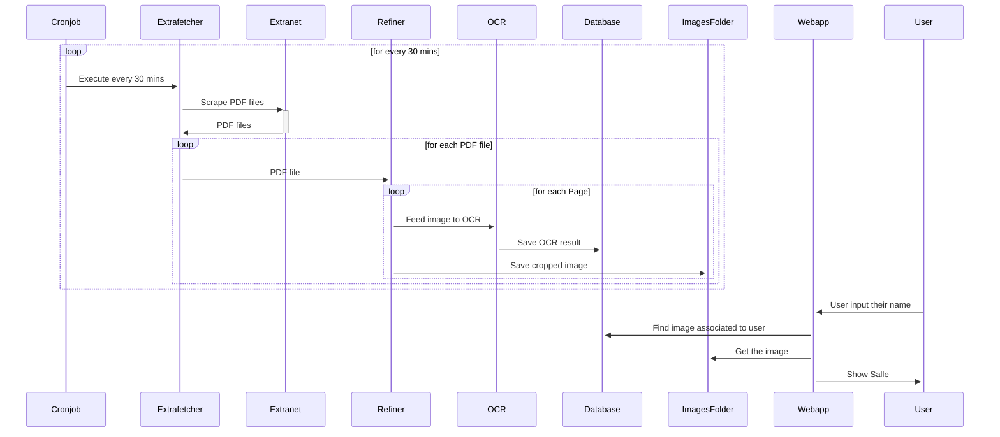

# Auto Emploi FSM

A small personal project to automate the search for your class in the exams week (if you study in FSM). You can use it at https://fsm.jbara.xyz

## How it works
This codes automates logging into [FSM Extranet space](https://fsm.rnu.tn//extranet) using your credentials (and ORC on their weak captcha) and retrieves the pdf documents for the time and location of latest day's exams. It then applies OCR on every page of the documents and automates the search for the class you are searching for.

## Installation
If you wish to use this locally or host it yourself. You can clone the repo and then install the pip requirements by issuing the following command.
*Note: It is advised you use a python virtual environment for this.*  
```
pip install -r requirements.txt
```
Make sure both Mozilla Firefox and [Geckodriver](https://github.com/mozilla/geckodriver/releases/) are installed on your system and accessible via `PATH` as they're both needed by selenium.  
Make sure to install tesseract as it is needed by pytesseract.

*Note: If you'd like to help port this to use chromium, pull requests are welcome!*  
## Usage
In order to fetch the latest pdf documents and treat them. Note that this will ask you for your login credentials when you use it for the first time. Which they'll be stored in `credentials.json`
```
python autodevoir-cli fetch <username> <password>
```
After that feel free to run the basic web app and test it out
```
gunicorn webapp:app
```
In order to update (say, a new pdf document is released upstream) just re-run the `python autodevoir-cli fetch`

While it's not recommended yet. `autodevoir-cli` is made to be run in a cronjob to frequently check for updates upstream.

**NOTE**: Only works on UNIX and UNIX-like Operating systems. If you would like to try this on windows, use WSL or feel free to edit the code (don't forget to PR).

**Extra**: While this is made for testing purposes. It can be useful to get the filenames that are related from the CLI. (say for an automation script or a custom app you're working on). Run `python autodevoir-cli find` to use the CLI instead of web.

